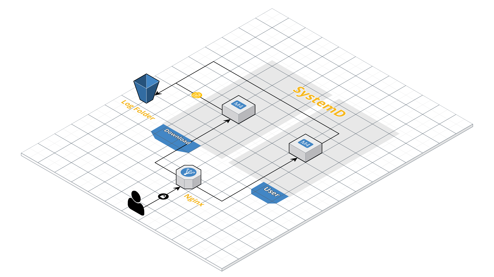

# Sistemas Embebidos

## Introducción

Este proyecto para la materia Sisteas Operativos 2 consistía en dos procesos ejecutandose, ambos escritos en C, y accesibles por un servidor web NGINX. Dejo abajo los requerimientos que me solicitó la cátedra.

## Objetivo
El objetivo del presente trabajo práctico es que el estudiante tenga un visión _end to end_ de una implementación básica de una _RESTful API_ sobre un _sistema embedido_.
El estudiante deberá implementarlo interactuando con todas las capas del procesos. Desde el _testing_ funcional (alto nivel) hasta el código en C del servicio (bajo nivel).

## Desarrollo
### Requerimientos
Para realizar el presente trabajo practico, es necesario una computadora con _kernel_ GNU/Linux, ya que usaremos [SystemD][sysD] para implementar el manejo de nuestro servicios.
También se necesita tener instalado [nginx][ngnx] y [ulfius][ulfi] para lo que pide la cátedra, como así también la CLI de `aws`  para conectarse a S3.

### Desarrollo
Se deberá implementar dos servicios en lenguaje C, estos son el _servicio de usuarios_ y el _servicio de descarga_. Cada servicio deberá exponer una _REST API_. Con el objetivo de acelerar el proceso de desarrollo vamos a utilizar un _framework_: se propone utilizar [ulfius][ulfi]. El estudiante puede seleccionar otro, justificando la selección, o implementar el propio (no recomendado).
El servicio debe tener configurado un [nginx][ngnx] por delante para poder direccionar el _request_ al servicio correspondiente.
El web server, deberá autenticar el _request_ por medio de de un usuario y password enviado en el _request_, definido donde el estudiante crea conveniente. Las credenciales no deberán ser enviadas a los servicios. 

El web server deberá  retornar _404 Not Found_ para cualquier otro _path_ no existente.

A modo de simplificación, usaremos sólo _HTTP_, pero aclarando que esto posee *graves problemas de seguridad*.
Todos los servicios deben estar configurados con _SystemD_ para soportar los comandos, _restart_, _reload_, _stop_, _start_ y deberán ser inicializados de manera automática cuando el sistema operativo _botee_.

Los servicios deber _logear_ todas sus peticiones con el siguiente formato:

```sh
    <Timestamp> | <Nombre Del Servicio> | <Mensaje>
```

El _\<Mensaje\>_ sera definido por cada una de las acciones de los servicios.

El gráfico \ref{fig:arq} se describe la arquitectura requerida.





A continuación, detallaremos los dos servicios a crear y las funcionalidades de cada uno.

### Servicio de Usuarios
Este servicio se encargará de crear usuarios y listarlos. Estos usuarios deberán poder _logearse_ vía _SSH_ luego de su creación.

#### POST /api/users
Endpoints para la creación de usuario en el sistema operativo:

```C
    POST http://{{server}}/api/users
```
Request
```C    
        curl --request POST \
            --url http:// {server}}/api/users \
            -u USER:SECRET \
            --header 'accept: application/json' \
            --header 'content-type: application/json' \
            --data '{"username": "myuser", "password": "mypassword"}'
```
Respuesta
```C

        {
            "id": 142,
            "username": "myuser",
            "created_at": "2019-06-22 02:19:59"
        }

```
El _\<Mensaje\>_ para el log será: _Usuario \<Id\> creado_
  
#### GET /api/users
Endpoint para obtener todos los usuario del sistema operativo y sus identificadores.
```C
    GET http://{{server}}/api/users
```
Request
```C
    curl --request GET \
        --url http://{{server}}/api/users \
        -u USER:SECRET \
        --header 'accept: application/json' \
        --header 'content-type: application/json'
```
Respuesta
```C
    {
      "data": [
          {
              "user_id": 2,
              "username": "user1",  
          },
          {
              "user_id": 1,
              "username": "user2"
          },
          ...
      ]
    }
```
El  _\<Mensaje\>_ para el log será:  _Usuario listados: \<cantidad de usuario del SO\>_
 
### Servicio de descarga
Este servicio pondra en disposición links de descarga de archivos de GOES. Ante la peticion de un usuario (POST), si el archivo solicitado ya ha sido descargado con anterioridad, se le avisa al suario que ya existe y se envia el link. Ante la peticion de un usuario de un archivo que no ha sido descargado, se debe avisar al usuario que no existe y que se debe descargar, se descarga de AWS S3 el archivo peticionado (en bakcground) y se avisa al usuario una vez que ha sido descargado. En ambos casos, la respuesta siempre es se debe retornar el link de descarga del tipo _http://{{server}}/data/filename_, de donde el usuario pordrá obtener el o los archivos.

#### POST /api/servers/get_goes
```C
    POST http://{{server}}/api/servers/get_goes
```
Request

```C
    curl --request POST \
        --url http://{{server}}/api/servers/get_goes \
        -u USER:SECRET \
        --header 'accept: application/json' \
        --header 'content-type: application/json'
        --data '{"product": "OR_ABI-L2-MCMIPF", "datetime": "Y%m%d%h"}
```

Respuesta
```C
    {
    "files": [
          {
              "file_id": 1
              "link": "http://{{server}}/data/OR_ABI-L2-MCMIPF-M6_G16_s20210661636116_e20210661638489_c20210661638589.nc",
              "filesize": "345 kb"  
          },
          ...
          {
              "file_id": n,
              "link": "http://{{server}}/data/OR_ABI-L2-MCMIPF-M6_G16_s20210661634116_e20210661648489_c20210661648589.nc",
              "filesize": "4,5 T"
          },
    }
```

El formato del campo _datetime_, deve ser definido por ustedes, pero debe conetenr año, día juliano y hora. El archivo a descargar será el primer arcvhivo de cada hora.
El log tendrá dos partes:
 -  _Archivos descargados nuevos: \<cantidad de archivos descargados nuevos\>_
 -  _Archivos descargados preexistentes: \<cantidad de descargados preexistentes\>_
    
#### GET /api/servers/get_goes
Este endpoint perimte al usuario conocer la lista de archivos que hay en el server
```C
    GET http://{{server}}/api/servers/get_goes
```
Request
```C
    curl --request GET \
        --url http://{{server}}api/servers/get_goes \
        -u USER:SECRET \
        --header 'accept: application/json' \
        --header 'content-type: application/json'
```
Respuesta
```C
    {
    "files": [
          {
              "file_id": 1
              "link": "http://{{server}}/data/OR_ABI-L2-MCMIPF-M6_G16_s20210661636116_e20210661638489_c20210661638589.nc",
              "filesize": "345 kb"  
          },
          ...
          {
              "file_id": n,
              "link": "http://{{server}}/data/OR_ABI-L2-MCMIPF-M6_G16_s20210661634116_e20210661648489_c20210661648589.nc",
              "filesize": "4,5 T"
          },
    }
```

El _\<Mensaje\>_ para el log será: _ Archivos en el server: \<cantidad de archivos en el server\>_.
    

 
## Resolución
Para desarrollar todo esto, se armaron ambos programas por separado. Cada uno con su lógica.

### users.c
Este código soporta métodos GET y POST. 
El GET devuelve una lista de los usuarios creados en el sistema en el archivo `/etc/passwd`, mientras que el POST recibe dos parámetros, un user y un password. El programa recibe los parámetros, revisa que ambos sean strings, los valida, que el user no esté repetido, y si todo está bien, carga el nuevo user con el comando `useradd`.

### goes.c
Este código soporta métodos GET y POST. 
El GET devuelve la lista de archivos almacenados en un directorio, en formato link, permitiendo al usuario descargar el mismo directamente de este. 
El POST recibe como parámetros un producto goes, archivos satelitales capaces de ser tratados y convertidos en imagenes, que se encuentran en el servicio S3 de Amazon, y la fecha del producto.
Si el servicio ya tiene el producto solicitado, le devuelve al usuario un link para que lo descargue. Si no lo tiene, envía al usuario un mensaje de que no lo tiene, y que intente nuevamente más tarde. Mientras tanto, descargará el producto y lo guardará entre sus archivos. La petición a la red del archivo se hace en días Julianos, por lo que el programa hace la conversión.

### Configuración de NGINX
Para realizar esto, se escribieron los archivos de configuración referidos a los dos procesos y la configuración del `sites-availables` de nginx. Con esto se puede configurar.

En el caso de los servicios, es la especificación del binario a ejecutar, el usuario que lo hará y el comando a ejecutar en caso de reload.
En el caso de los `sites-availablesp`,  se especifica la url que se usará, a donde apuntará (cada servicio fue asignado a un puerto) y donde ver los archivos para la descarga.

### Instalación
La instalación se da con el comando `make` el cual ejecuta el makefile del proyecto. 
Los servicios al estar escritos en C se compilan. Luego el make crea los usuarios para cada servicio, almacena los binarios en el directorio `/usr/bin`, copia los archivos de configuración de nginx, crea los logs donde se guardarán los registros, recarga el nginx y encinede los servicios.

### Testing
Para probar el correcto funcionamiento, se puede usar herramientas como `postman` en la que podemos hacer las consultas HTTP.

## Referencias y ayudas
- [Systrem D ](https://systemd.io/)
- [System D en Freedesktop](https://www.freedesktop.org/wiki/Software/systemd/)
- [nginx](https://docs.nginx.com/)
- [Ulfius HTTP Framework](https://github.com/babelouest/ulfius)
- [Kore Web PLataform](https://kore.io/)

[sysD]: https://www.freedesktop.org/wiki/Software/systemd/
[ngnx]: https://docs.nginx.com/
[ulfi]: https://github.com/babelouest/ulfius
